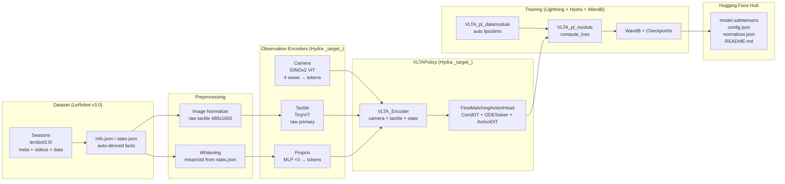

# Origami IROS — Bimanual VLTA Flow-Matching Policy

Bimanual imitation-learning policy that maps multimodal observations (four camera
views, raw tactile images, proprioceptive state) to chunks of future joint
actions using a conditional-OT flow-matching head.

## Architecture



- **Data facts** (fps, action_dim, image sizes, tactile_dim) are read from
  `meta/info.json` at runtime — never hard-coded in Hydra config.
- **Preprocessors** whiten actions/state from `meta/stats.json`.
- **Encoders** and **action head** are injected into `VLTAPolicy` as
  Hydra `_target_` objects via `src/origami_iros/models/factory.py`.
- **Training** uses Lightning + Hydra + WandB; `configure_optimizers` returns a
  `torch.optim.Optimizer` (wrapped with a cosine-with-warmup scheduler).
- **Hub push** is toggled via `hub.push=true` and uploads
  `model.safetensors` + `config.json` + `normalizer.json`.

## Installation

```bash
uv sync
# or
pip install -e .
```

Requirements: Python ≥3.12, PyTorch, `flow-matching`, `lerobot`, `lightning`,
`hydra-core`, `wandb`, `transformers`, `huggingface_hub`, `safetensors`.

## Dataset Layout

```
dataset/
  season_POC22032_.../lerobot3.0/
    meta/info.json      # fps, features, shapes
    meta/stats.json     # mean/std for whitening
    meta/modality.json
    videos/             # head_left/right, wrist_left/right, tactile_raw
    data/chunk-000/
```

All seasons are discovered automatically; `fps` and dimensions are derived from
the first season's metadata.

> **Note:** `tactile_deform` is all zeros in the current recordings. The
> policy uses `tactile_raw` (480×1600) as the primary tactile stream.

## Training

```bash
# default (all seasons, auto-derived dims)
python train.py

# override
python train.py data.batch_size=32 data.chunk_size=8

# debug CPU smoke
python train.py debug=cpu

# push to hub at end
huggingface-cli login
python train.py hub.push=true hub.repo_id=your-org/vlta-north-ces hub.private=false
```

Config lives in `configs/` (Hydra). Data facts are auto-derived; only
architecture/training choices are in YAML. See `configs/model/default.yaml` and
`configs/data/default.yaml`.

Training logs to WandB (`vlta-flow-matching`) and `checkpoints/`. Checkpoints
are saved every `callbacks.checkpoint_every_n_steps`.

## Evaluation

```bash
python eval.py ckpt_path=checkpoints/step-1000.ckpt
python eval.py ckpt_path=checkpoints/last.ckpt data.batch_size=8
```

`eval.py` loads the checkpoint, runs `trainer.validate`, and samples a few
batches under `torch.inference_mode()` for qualitative checks (sampling is
explicitly wrapped at the call site, not baked into the model).

## Using a Pretrained Model (Hub)

After `hub.push=true`, the repo contains:

- `model.safetensors` — policy state dict
- `config.json` — model arch + resolved data facts
- `normalizer.json` — `action` mean/std for un-whitening
- `README.md` — hub usage (this file's hub section is uploaded)

```python
import json, torch
from pathlib import Path
from safetensors.torch import load_file
from origami_iros.models.factory import build_vlta_policy
from origami_iros.train.config import ModelConfig

# reconstruct policy
cfg = json.loads(Path("config.json").read_text())
model_cfg = ModelConfig(**cfg["model"])
policy = build_vlta_policy(model_cfg, chunk_size=cfg["data_facts"]["chunk_size"])
policy.load_state_dict(load_file("model.safetensors"))
policy.eval()

# sample (explicit inference_mode at call site)
obs = ...  # Observation tensorclass batch
with torch.inference_mode():
    pred_whitened = policy(obs)  # (B, chunk, 65)

norm = json.loads(Path("normalizer.json").read_text())
mean = torch.tensor(norm["action"]["mean"])
std = torch.tensor(norm["action"]["std"])
pred = pred_whitened * std + mean  # un-whiten to robot units
```

> `policy(obs)` is the inference path (ODE sampling). For training, use
> `policy.compute_loss(obs, target_action, action_is_pad)`.

## Project Structure

```
configs/                 # Hydra configs (data/model/optimizer/callbacks/wandb/hub)
src/origami_iros/
  data/                  # metadata, preprocessing, dataset, collate
  models/
    encoders/            # camera, tactile, proprio
    action_head/         # flow-matching + velocity transformer
    policy/              # VLTAPolicy (takes encoder + action_head via _target_)
    factory.py           # Hydra _target_ builders
  train/                 # LightningModule, DataModule, callbacks, hub push
train.py                 # Hydra training entrypoint (root)
eval.py                  # Hydra evaluation entrypoint (root)
```

## Implementation Notes

- `VLTAPolicy.forward` delegates to `sample_actions` without an internal
  `torch.no_grad()` — callers wrap inference in `torch.inference_mode()` /
  `torch.no_grad()` explicitly (see `LightningModule.sample_for_logging`).
- `LightningModule.configure_optimizers` returns a `torch.optim.Optimizer`
  (`LRScheduleOptimizer` wrapping AdamW + cosine-with-warmup).
- All overridden base / Lightning hooks use `from typing import override`
  (built-in, Python 3.12).
